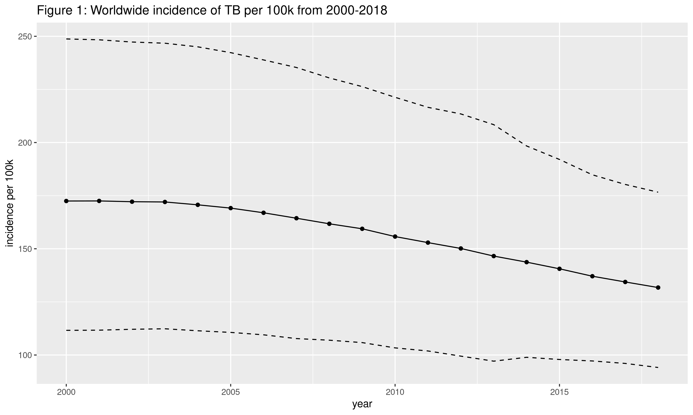
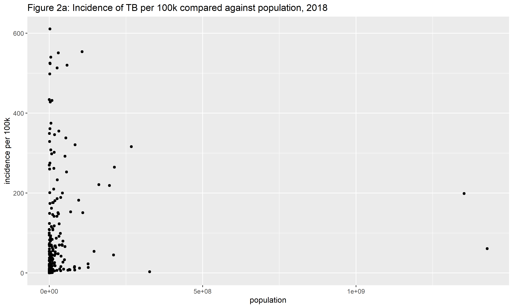
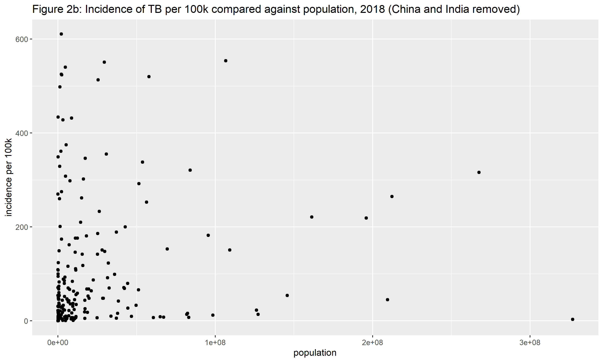
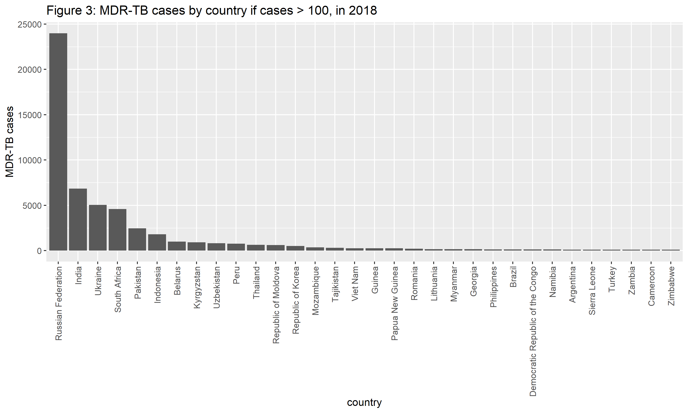

Project 1 Bios 611
==================

Tuberculosis dataset
--------------------

Proposal
--------

### Description

I will look at tuberculosis (TB) [data](https://www.who.int/tb/country/data/download/en/) published by the World Health Organization (WHO). I will mainly look at longitudinal data that relates the burden of disease with treatments. The finest aggregation is at the country-level. I will pay particular attention to information relating to multi-drug resistant TB (MDR-TB) e.g. estimates on patients undergoing MDR-TB treatment for a given country-year and their outcomes. 

### Preliminary figures

Figure 1 shows incidence of TB per 100k averaged (simple average) across all countries from 2000-2018 (solid line). Since measurement was imperfect, the data consists of estimates with upper and lower bounds. The dashed lines represent the average upper and lower bounds. Incidence was flat in the early 2000's but declined at a steady pace until 2018. (As a side note, it appears that this recent progress may be seeing at least somewhat of a [reversal](https://www.nytimes.com/2020/08/03/health/coronavirus-tuberculosis-aids-malaria.html) due to covid.)

Figures 2a and 2b plot incidence per 100k against population in 2018, with the latter plot having China and India removed, the right-most points in the first plot. Even though incidence in this case already has population in its denominator, the plots may still be interesting to see how incidence scales with population size. No immediate relationship jumps out, although it does appear that the most afflicted countries tend to be relatively small. 

I shift now to prevalence of MDR-TB in 2018. Figure 3 shows raw case counts of MDR-TB by country in descending order and only including those with over 100 cases. This plot shows Russia as being by far the worst in terms of raw case counts, although I keep in mind its large population as well.

### Questions

- First, I would like to get a basic sense of TB incidence over time, both completely aggregated and then disaggregated by country. This will likely take the form of a map.
- How does MDR-TB incidence vary by country? Do all countries with high TB incidence also have high MDR-TB incidence? Which types of countries are mainly affected by it? When was it introduced to these countries?
- How do treatment outcomes vary? 
- How do treatment regimes vary by incidence?
- What are the differences in the history of the disease in wealthy vs. non-wealthy countries?

### Modeling and visualizations

I will start with maps that show incidence. Given that standard maps may be [misleading](http://www.stat.columbia.edu/~gelman/research/published/allmaps.pdf) since they do not show uncertainty, I will try a recent proposal to plot this uncertainty using pixelation ([Taylor et al.](https://arxiv.org/abs/2005.11993)). 

To further describe the data, I may compute correlations or other measures of association between relevant variables. Depending on the circumstance, these may either be maximum likelihood or Bayesian estimates. 

Since the data is longitudinal, some simple time series models may also be implemented. One possible goal could be to predict the next year's incidence rates, worldwide and by nation. 

### Criteria for completion

The project is open-ended and there is purposefully no specific goal in mind. The idea is to do a descriptive analysis to gain an understanding of the data rather than make any claims of causality. Loosely, I will say that the criteria for completion is attempting to answer the above questions and either finding the answers to them or the reasons why they cannot be reasonably answered with just the data given here.