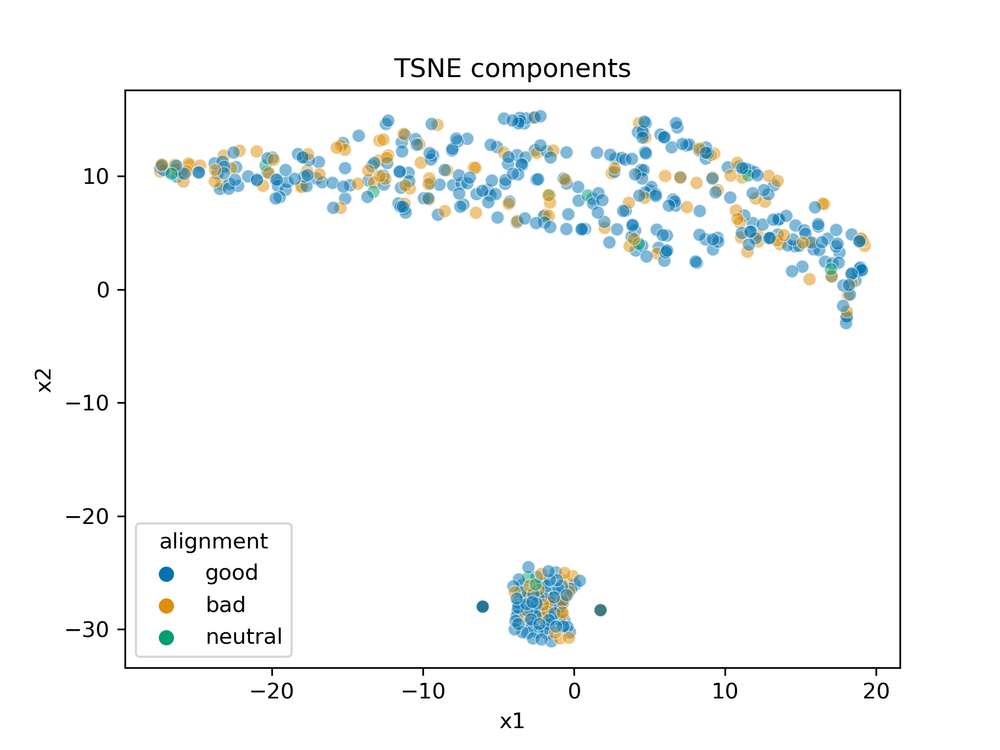

```{r setup, include=FALSE}
knitr::opts_chunk$set(echo = TRUE, warning = FALSE, message = FALSE)
```

```{r}
# load libraries
library(gbm)
library(gridExtra)
library(caret)
library(tidyverse)
```

## Question 1

```{r}
# download and read data
download.file('https://raw.githubusercontent.com/Vincent-Toups/bios611-project1/master/source_data/datasets_26073_33239_weight-height.csv',
              './weight_height_data.csv')
wh_dat = read_csv('weight_height_data.csv')

# create indicator for female
wh_dat$Female = as.numeric(wh_dat$Gender=='Female')
```

```{r}
# fit gbm
set.seed(82978113)
gbm_fit = gbm(Female ~ Height + Weight, data = wh_dat, distribution = 'bernoulli')

# report accuracy
gbm_predict = as.numeric(predict(gbm_fit, type='response') >= 0.5)
conf_mat_gbm = table(gbm_predict, wh_dat$Female, dnn = c('predicted', 'observed'))
conf_mat_gbm_prop = conf_mat_gbm %>% prop.table()
accuracy_gbm = conf_mat_gbm_prop[1,1] + conf_mat_gbm_prop[2,2]

# print out confusion matrix
conf_mat_gbm
```
With this dataset, a GBM model using the default hyperparameters (and no tuning) has accuracy of `r round(accuracy_gbm, 3)` compared to an accuracy of `0.63` using the dataset in the previous homework. The GBM is abe to classify this dataset better than the last. 

## Question 2

```{r}
# download and read data
download.file('https://raw.githubusercontent.com/Vincent-Toups/bios611-project1/master/source_data/datasets_38396_60978_charcters_stats.csv',
              './superhero_stats.csv')
superhero = read_csv('superhero_stats.csv')
```

### Part 1

```{r, include=FALSE}
# look at missing data
apply(superhero, 2, function(x) sum(is.na(x)))
superhero = superhero %>% filter(!is.na(Alignment))

# are there repeat observations?
length(unique(superhero$Name)) == nrow(superhero)

# how many repeats?
table(superhero$Name) %>% sort(decreasing=TRUE) %>% head()

# are the observations different for Nova?
superhero %>% filter(Name=='Nova')

# rename the Nova
superhero = superhero %>% 
  mutate(Name = ifelse(Name=='Nova' & Intelligence==100, 'NovaA',
                       ifelse(Name=='Nova' & Intelligence==38, 'NovaB', Name)))
```

There are only three missing values in the entire dataset and they are in the `Alignment` column. Since the later questions ask about this column, for simplicity I will remove the three observations with missingness.

I also checked to see if there were duplicates. One superhero, Nova, appeared twice but their abilities were different. Therefore, I assume there are two different superheros both named Nova and leave these observations in the dataset but rename them as NovaA and NovaB. See the .Rmd file for details.


### Part 2

```{r}
# pca
superhero_pca = prcomp(superhero %>% select_if(is.numeric), center = TRUE, scale. = TRUE)
summary(superhero_pca)
```
From the results of the principal components analysis (PCA) above, we see that two principal components are enough to capture about 85 percent of the variation in the dataset.


### Part 3

We do need to normalize these columns (and this was done). PCA is a method that captures variance so we want all the columns to be on the same scale in order to appropriately compare them with each other. If we did not normalize, then the results of PCA would be conditional on the units of a variable; for instance, a variable in centimeters will yield different results than if that variable was in miles. 

### Part 4

```{r}
# check to see if ability totals match up with total column
which_equal = apply(superhero %>% select(Intelligence:Combat), 1, sum) == superhero$Total
all(which_equal)
```

See code above. The `total` column indeed is the total of the other values in the other columns.


### Part 5

No, we should not have included that column in the PCA since it is a linear combination of the other variables in the dataset and therefore does not add any additional information. Looking at the weights for the first principal component below, we see that each variable has similar weighting with `Total` having slightly higher.

```{r}
# first principal component
summary(superhero_pca)$rotation[,1] %>% round(3)
```


### Part 6

```{r}
plot(superhero_pca$x[,1], superhero_pca$x[,2],
     xlab = 'PC1', ylab = 'PC2', main = 'Components from PCA')
```

<!-- ```{r} -->
<!-- transformed <- do.call(rbind, Map(function(row){ -->
<!--     v <- solve(superhero_pca$rotation) %*% c(superhero$Intelligence[row], -->
<!--                                    superhero$Strength[row], -->
<!--                                    superhero$Speed[row], -->
<!--                                    superhero$Durability[row], -->
<!--                                    superhero$Power[row], -->
<!--                                    superhero$Combat[row], -->
<!--                                    superhero$Total[row]); -->
<!--     tibble(c1=v[1], -->
<!--            c2=v[2], -->
<!--            c3=v[3], -->
<!--            c4=v[4], -->
<!--            c5=v[5], -->
<!--            c6=v[6], -->
<!--            c7=v[7]);     -->
<!-- }, -->
<!-- seq(nrow(superhero)))) -->

<!-- ggplot(transformed, aes(c1,c2))+ geom_point() -->
<!-- ``` -->

The above graph plots the second principal component against the first. No obvious clusters or structure emerge.


## Question 3

```{r}
# run python script to fit model and plot
system('python3 hw5_tsne.py')
```

```{r}
# load tsne results
superhero_tsne = suppressMessages(read_csv('superhero_tsne_results.csv', col_names=FALSE))

# append alignment
superhero_tsne = superhero_tsne %>%
  mutate(alignment = superhero$Alignment,
         alignment = ifelse(is.na(alignment), 'missing', alignment)) 

# plot
gg_tsne = ggplot(superhero_tsne, aes(x = X1, y = X2, color = alignment)) +
  geom_point(alpha = 0.5) + 
  labs(title = 'TSNE components') +
  scale_color_manual(values = c('orange', 'deepskyblue2', 'red'),
                     limits = c('good', 'bad', 'neutral'))

gg_tsne
```

I fit the model in Python (with default hyperparameters), export the results to a .csv, read them in R, then plot the two dimensions using ggplot. There are two obvious clusters TSNE identified but they do not correlate to the alignment label. 


## Question 4

I reproduce the same plot using the Seaborn library in Python. 



## Question 5

```{r}
# specify type of resampling: 10-fold CV repeated 10 times
fitControl = trainControl(method = "repeatedcv", number = 10, repeats = 10)

# train model
set.seed(768112482)
gbm_caret = train(Alignment ~ ., data = superhero %>% select(-Name, -Total), 
                  method = 'gbm', trControl = fitControl, verbose = FALSE)

gbm_caret
```
As you can see from the output above, most combinations of the parameters tested give similar accuracy. The one with the highest accuracy had the number of trees at 50 and interaction depth at 2. The other parameters in the model that were not varied are shrinkage at 0.1 and the number of minimum observations in each node at 10. 


## Question 6

We want to use k-fold cross-validation (CV) in order to do model selection. In the previous example, we used CV to pick out hyperparameters of a GBM. In general, cross-validation accuracy gives an accuracy that is more robust to overfitting. There are two components to this. First, after fitting a model, it is better to assess accuracy by testing on some holdout data. If the model performs well on the holdout data then we would be more confident that we are not overfitting on some noise, which could happen if you assess accuracy on the same dataset that the model was trained on. This motivates the cross-validation part. Second, we want to do this procedure multiple times to avoid situations where we get lucky or unlucky since a random holdout set can be peculiar in some way. This is the k-fold part, where often larger k is better for more accurate error estimates but more computationally intensive. 


## Question 7

Recursive feature selection is greedy "top-down" algorithm to select features in a model. It follows the following procedure:

1. Begin by training the model using the whole feature set.
2. Calculate some metric for goodness of fit (e.g. CV error).
3. Calculate some importance metric for each feature.
4. Remove some number of features based on low importance scores.
5. Compute the model again with the remaining features. 
6. Repeat steps 2-5 until some threshold of goodness of fit or number of features is satisfied.

The algorithm is greedy because at each step, it only considers the most optimal decision at that point while ignoring the possibility that a sub-optimal decision at that step may lead to a more optimal model after subsequent steps.