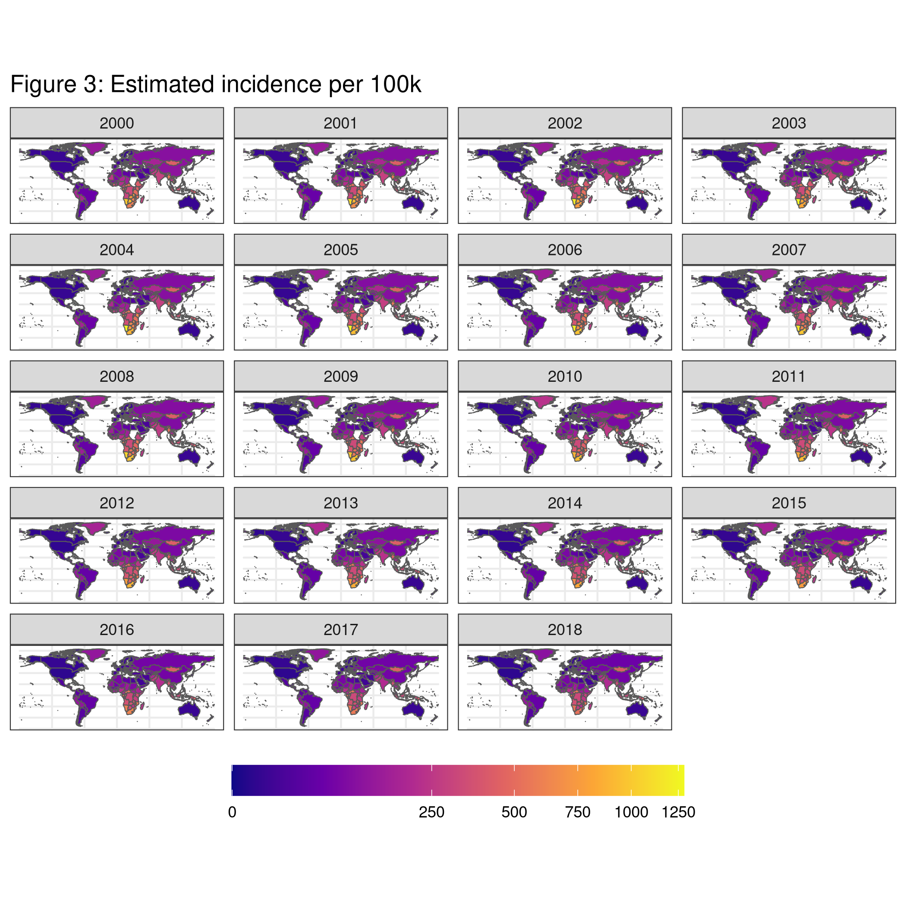
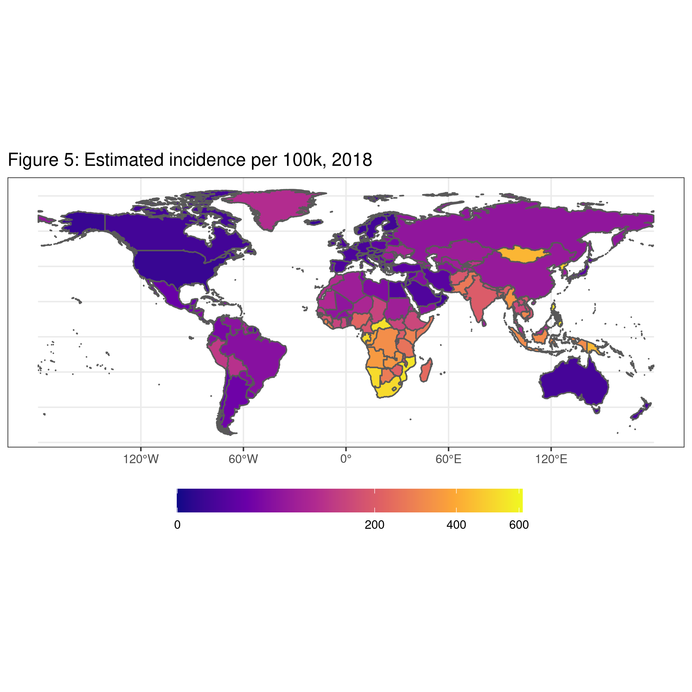
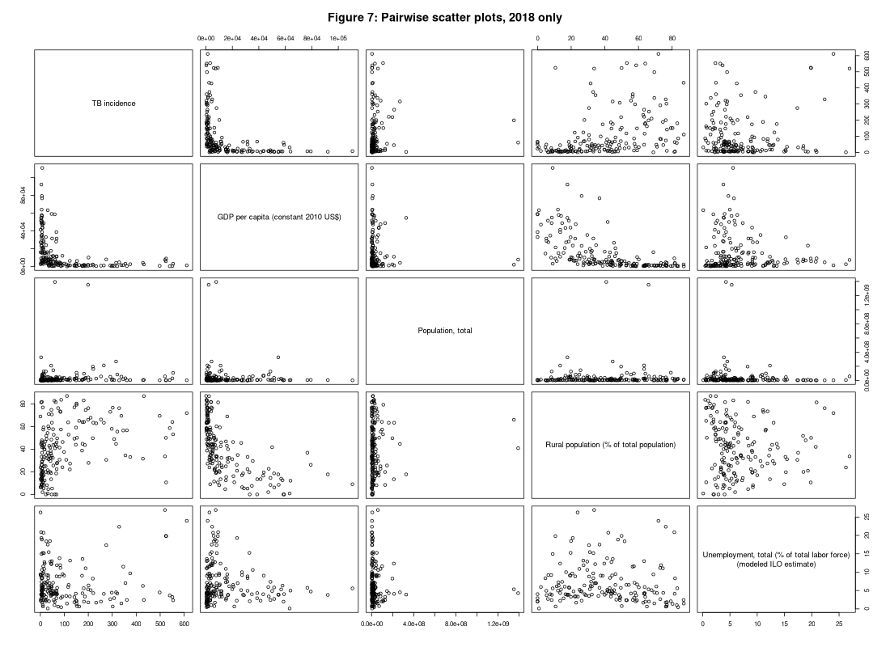

```{r setup, include=FALSE}
# knitr::opts_knit$set(root.dir = "C:/Users/mjets/Dropbox (Personal)/BIOS 611/project1")
knitr::opts_knit$set(root.dir = "~/Dropbox/BIOS 611/project1")
knitr::opts_chunk$set(echo = FALSE, warning = FALSE, message = FALSE)
```

```{r, include=FALSE}
source('code/load_libraries.R')
```

Note: work in progress. I left things like writing and model-building out and focused on following the prescribed workflow since it seems like that's what you wanted us to get down moreso than the other stuff. Also, I know some of the code and variable names need to be cleaned up. Formatting of plots and tables also need work.

## Introduction

Tuberculosis (TB) is a deadly infectious disease that has persisted for centuries. Treatments created in the mid to late 20th century, along with public health campaigns, lowered disease prevalence and mortality, especially in wealthy countries like the United States where the disease has been essentially eradicated. A vaccine for TB has been available for nearly a century but it does not have 100 percent efficacy so the disease persists despite the vaccine being widely administered. Complicating the public health picture was the emergence of multi-drug resistant TB (MDR-TB) in the 1970s and 80s. Tuberculosis continues to kill many people today.

The purpose of this report is to explore recent TB data and get a better sense of incidence and how it varies by country and type of country. I am also interested to see how characteristics of TB vary within the subset of countries with high incidence rates. Are these countries similar in respect to mortality? Cost of treatments? MDR-TB rates?


## Data

I use TB [data](https://www.who.int/tb/country/data/download/en/) from the World Health Organization (WHO). Some of the data is cross-sectional and some is longitudinal by year from 2000-2018. 

I also use a variety of country-level [indicators](https://databank.worldbank.org/source/world-development-indicators#) from the World Bank. I chose indicators that have little to no missingness and that may reasonably relate to TB incidence, but the decision was somewhat arbitrary. A task for later may be to include all indicators and do feature selection to filter out the un-important ones. 


## Mapping TB incidence





## Predicting TB incidence with country-level development data





### Feature selection

Ended up with a lot more missingness than I anticipated. So I had to throw away a lot of the variables I was interested in and was only left with the basic ones, and even then I still had to throw away many countries because of missingness. The result was too few variables to do any meaningful feature selection so I am putting a pin in this part for now. There are some things I could do with imputing the missing data but I'm not sure if it's worth the effort for the purposes of this class. See below for variables used.

```{r}
meta = read_csv('data/derived_data/country_indicators_reg_meta.csv')
kable(meta)
```

### Model selection

I didn't hold out a test set here to compare different models (yet). But I did do validation for each model separately. I used linear regression and random forests both with and without the HCI variable. The errors for linear regression were from 5-fold cross-validation and the errors for the random forests were the out-of-bag errors. 

```{r}
error_tab = readRDS('models/inc_model_comparison.rds')
kable(error_tab)
```

Coefficients for the linear regression model with HCI:

```{r, results='asis'}
lm_fit1 = read_rds('models/lm_fit_yes_hci.rds')
stargazer(lm_fit1, header=F)
```

Coefficients for the linear regression model without HCI:


```{r, results='asis'}
lm_fit2 = read_rds('models/lm_fit_no_hci.rds')
stargazer(lm_fit2, header=F)
```


## Characterizing TB outcomes

Still to do.