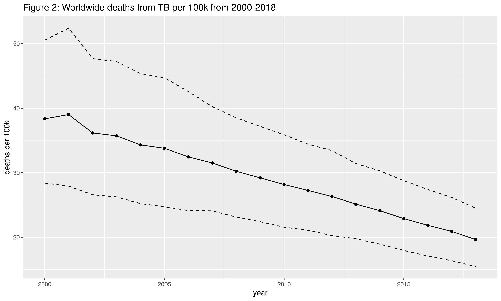
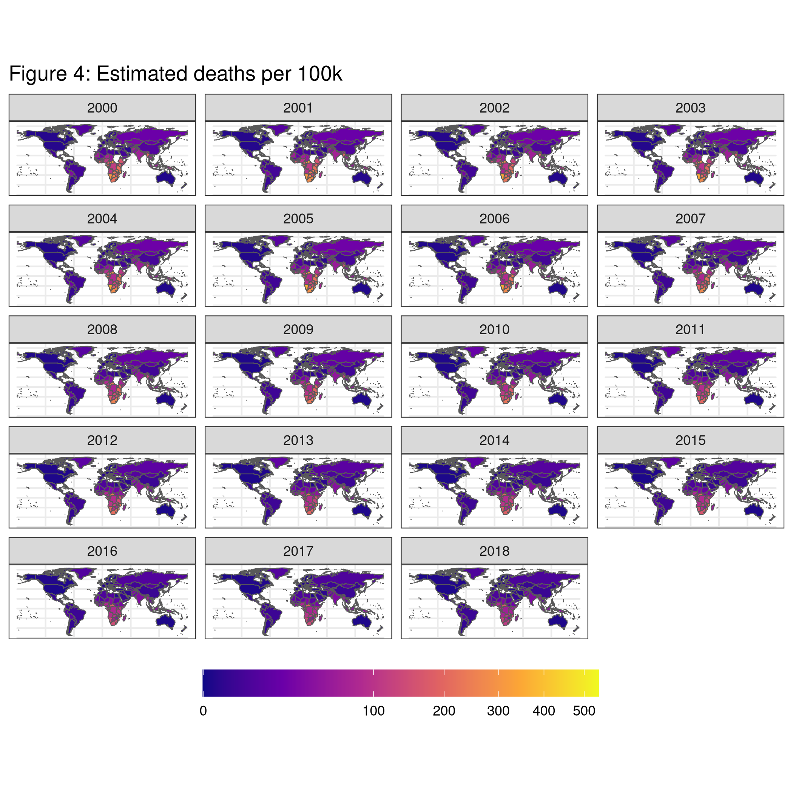
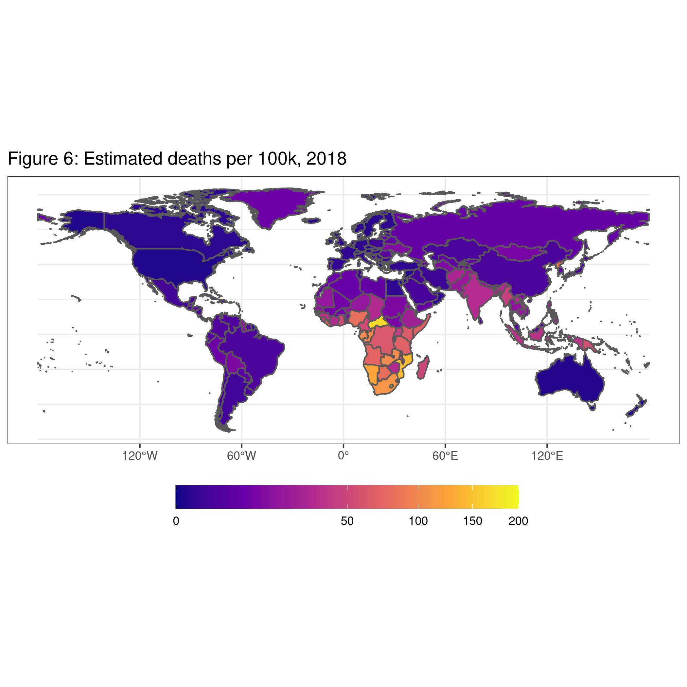
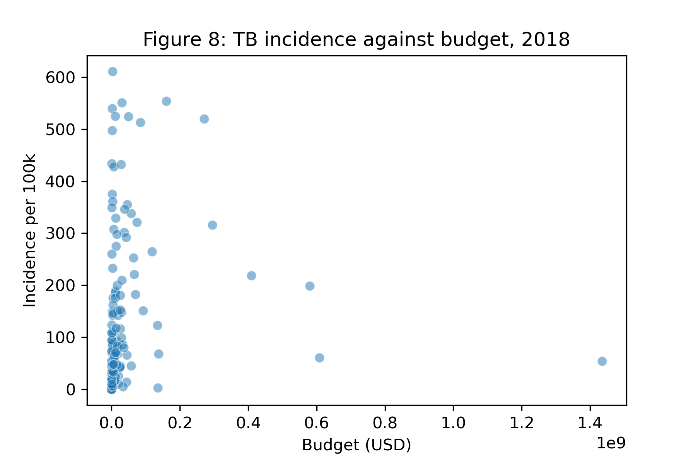

```{r setup, include=FALSE}
# knitr::opts_knit$set(root.dir = "C:/Users/mjets/Dropbox (Personal)/BIOS 611/project1")
# knitr::opts_knit$set(root.dir = "~/Dropbox/BIOS 611/project1")
knitr::opts_chunk$set(echo = FALSE, warning = FALSE, message = FALSE)
```

```{r, include=FALSE}
source('code/load_libraries.R')
```

## Introduction

Tuberculosis (TB) is a deadly infectious disease that has persisted for centuries. Treatments created in the mid to late 20th century, along with public health campaigns, lowered disease prevalence and mortality, especially in wealthy countries like the United States where the disease has been essentially eradicated. A vaccine for TB has been available for nearly a century but it does not have 100 percent efficacy so the disease persists despite the vaccine being widely administered. Complicating the public health picture was the emergence of multi-drug resistant TB (MDR-TB) in the 1970s and 80s. Tuberculosis continues to kill many people today.

The purpose of this report is to explore recent TB data and get a better sense of incidence and how it varies by country and type of country. 


## Data

I use TB [data](https://www.who.int/tb/country/data/download/en/) from the World Health Organization (WHO). Some of the data is cross-sectional and some is longitudinal by year from 2000-2018. 

I also use a variety of country-level [indicators](https://databank.worldbank.org/source/world-development-indicators#) from the World Bank. We chose indicators that have little to no missingness and that may reasonably relate to TB incidence, but the decision was somewhat arbitrary. A future task may be to include all indicators and do feature selection algorithmically. 


## TB incidence

In Figure 1 we plot worldwide TB incidence per 100,000 people over time (2000-2018) along with the upper and lower confidence intervals for each point estimate. We can see that the level of TB is still quite high but has declined slightly over the last couple decades (note that on a population scale, the lowest incidence rate on the graph still equates to about 10 million people). 


Figure 2 shows deaths and we also see a decline over the last two decades. Again, note that total level of deaths is still quite substantial on a population basis. The estimated total deaths in 2018, for instance, is higher than the total deaths due to Covid-19 worldwide to date ([source](https://www.worldometers.info/coronavirus/worldwide-graphs/#total-deaths)). 




The disease burden is not uniform across the world. Countries such as the United States have essentially eradicated the disease and new cases are relatively easily controlled by treatments and vaccines. However, the disease persists in many other countries, especially less wealthy ones. Figures 3 and 4 plot the estimated incidence and deaths per 100 thousand in each country where data is available for every year in the dataset. We observe that sub-Saharan Africa and parts of Asia are the most afflicted regions. Interestingly, not all countries with high incidence appear to have correspondingly high deaths - Mongolia, for example, has one of the highest TB rates in Asia, yet it does not particularly stand out in terms of deaths. It also appears that the situation has not gotten worse in most countries over these two decades. However, there does appear to be places like the Central African Republic where the situation does not appear to have gotten much better either. 





Since part of the subsequent analysis will focus on the most recent year with available data, we also include Figures 5 and 6 which show maps of incidence and deaths for 2018 only (note the change in scale from the previous figures). These graphs give a better sense of the variation of TB across countries. We again observe the high incidence in sub-Saharan Africa, South/Southeast Asia, and Mongolia. We also see from these graphs that some countries in South America, North Africa, and Asia have moderately high incidence rates as well. 





## Predicting TB incidence with country-level development data

In this section, we attempt to model TB incidence using country-level development data from the World Bank (for brevity and to focus our discussion, we do not discuss deaths in this modeling section). We evaluate model performance using predictive performance here. We use two general classes of models: linear regression by ordinary least squares and random forests. The advantage of the former is ease of interpretation while the latter often produces better predictions in many settings at the expense of interpretability. 

### Missing data

The World Bank publishes many indicators relating to development. Unfortunately, however, many of the more interesting indicators have a substantial amount of missingness. As a result, we only select a few features for our modeling. There is still some missingness in the features we are starting of with, and it may be reasonable to impute these but since that is outside the scope of this project, we will ignore observations with missingness, acknowledging that it does bias the analysis. In particular, we went from a dataset with 3917 country-years to 3335. 


### Examining the features

```{r}
meta = read_csv('data/derived_data/country_indicators_reg_meta.csv')
kable(meta %>% filter(`Series Code` != 'HD.HCI.OVRL') %>% select(`Series Name`), 
      caption = 'List of features used', col.names = NULL)
```

Table 1 lists the features we consider in this analysis. In Figure 7 we plot pairwise scatter plots for the outcome variable (incidence per 100k) and four select features that we believed a priori would perform at least as good as using the full feature set in the OLS case. These scatter plots use 2018 data only for simplicity. A few observations include: (1) all of the high incidence countries have relatively low GDP per capita; (2) countries that are more rural tend to have less GDP per capita and higher TB incidence but not always; and (3) many low unemployment countries have high incdence rates. 


### Model selection

I compare four different models here - three OLS models and one random forest. The first OLS model uses all the features described in Table 1 plus year fixed effects; the second uses the features shown in Figure 7 plus year fixed effects; and the third uses all the features but excludes year fixed effects. The random forest includes all the features and years (since overfitting is less of a concern with random forests we don't consider feature selection). 

To evaluate model performance, we held out 35 countries (about 20 percent of the dataset) and all their years in a test set. The remaining 80 percent of observations define the training set. Since OLS does not contain any hyperparameters, we simply fit those three models on the training set. The random forest model will be successively trained on the training set with different hyperparameters and the out-of-bag error was used to choose the optimal hyperparamters. In particular, we fit six models defined by the combinations of: number of trees $(500, 1000, 1500)$ and number of variables to sample at each split $(3,5)$. The chosen model used hyperparameters 1000 and 3. 

All four models will then be used to predict on the test set. The mean squared errors (MSE) for these four models are reported in Table 2. The table shows that the year fixed effects do not change the predictive strength of the OLS model and that the OLS model with all the features likely overfits the dataset since the model with only a subset of features performed better. All OLS models, however, performed poorly compared to random forests. Also included in the table is a naive model where the prediction for the test set is just the mean incidence of the training set. Comparing the OLS models to this model shows how poorly that class of models performs.

```{r}
error_tab = readRDS('models/inc_model_comparison.rds')
kable(error_tab %>% mutate(MSE = round(Error)) %>% select(-Error), caption = 'Model prediction errors summary')
```

## Relationship between incidence and budget

In Figure 8, we plot TB incidence per 100,000 people against the total TB-related budget in 2018 for all countries where data was available for both. The relationship is extremely non-linear with some countries like Russia (the right-most point) having very large budgets and moderate incidence while in most countries where TB is a huge problem, the budgets are much smaller.



## Future extensions

The dataset is rich and the analyses presented here only scratch the surface. In all the plots and models (besides the first graph), we did not take into account measurement error in the TB incidence estimates. The maps, for instance, could be improved by adding pixelation to represent uncertainty ([Taylor et al.](https://arxiv.org/abs/2005.11993)). The models could be adjusted to take into account the uncertainty by, say, a Bayesian model where the point estimates can be given distributions themselves. We should also consider what it means to holdout a random subset of countries - given the substantial heterogenity in countries this may not be a reasonable way to test predictive performance. A leave-one-out cross-validated approach would likely be better. 

As discussed before, missingness is a substantial issued that was intentionally ignored. One possible solution is to impute using other characteristics in the dataset or use an algorithm like multiple imputation by chained equations (MICE). It would be helpful to better characterize countries with a richer set of features but the missing data problem with the other development indicators published by the World Bank may be intractable so integrating another data source would help. 

There are many other aspects of the TB story to consider as well, such as the emergence and persistence of multi-drug resistant TB (MDR-TB), the budget used to fight this disease, and the relationship with HIV, to name a few. 


## Conclusions

From the maps of TB incidence and deaths over time, we saw that TB has declined slightly over the past two decades but continues to be a substantial problem that kills many people, especially in parts of Africa and Asia. We also saw that TB incidence appears to be associated with a few broad indicators but likely in some non-linear way as an OLS model performed poorly while a random forest model performed better. 